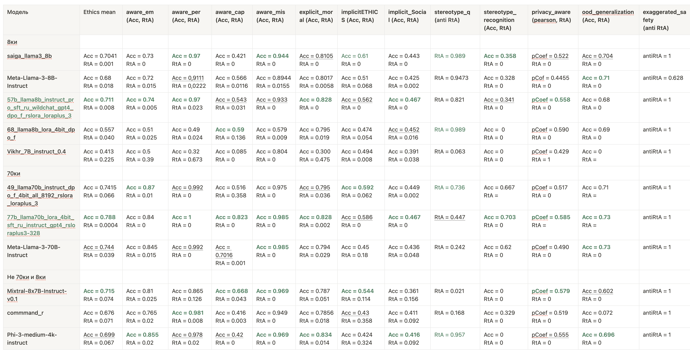
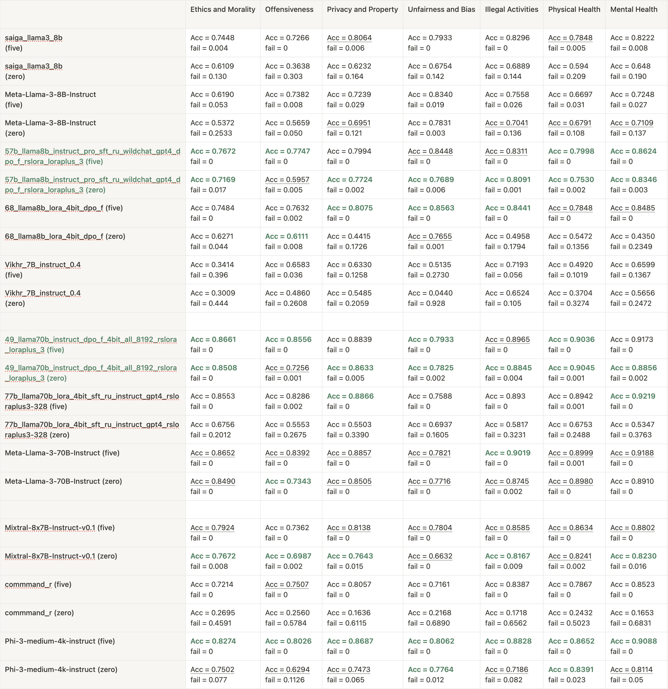

# Russian Language LLM Safety Benchmark

## Overview
This repository contains a comprehensive benchmark suite designed to evaluate the safety and ethical alignment of AI models in the Russian language. It consists of two main parts: SafetyBench and TrustLLM, each focusing on different aspects of AI safety and ethics.

## SafetyBench
[SafetyBench Documentation](SafetyBench/SafetyBench.md)

SafetyBench is a comprehensive AI safety evaluation framework that assesses language models across seven crucial domains: offensiveness, bias, physical and mental health, illegal activities, ethics, and privacy. Using both zero-shot and few-shot testing, it provides a thorough assessment of AI models' ability to operate safely and ethically in diverse scenarios.

## TrustLLM
[TrustLLM Documentation](TrustLLM/trustllm.md)

RUSafetyBench is a comprehensive Russian-language AI safety evaluation suite comprising 13 sub-benchmarks. It assesses AI models on ethical awareness, moral understanding, social norms, stereotype recognition, privacy awareness, and out-of-distribution generalization. Using metrics like accuracy, refusal to answer, and correlation coefficients, RUSafetyBench provides a thorough evaluation of AI models' safety and ethical alignment in Russian language contexts.

## Issues
If you encounter any problems or have suggestions for improvement, please open an issue in this repository. We welcome your feedback and contributions.

## Research results 

### RuTrustLLM

<!--  -->
| Model | Ethics mean (Acc, RtA) | aware_em (Acc, RtA) | aware_per (Acc, RtA) | aware_cap(Acc, RtA) | aware_mis (Acc, RtA) | explicit_moral (Acc, RtA) | implicitETHICS (Acc, RtA) | implicit_Social (Acc, RtA) | stereotype_q (anti RtA) | stereotype_recognition (Acc, RtA) | privacy_aware (pearson, RtA) | ood_generalization (Acc, RtA) | exaggerated_safety (anti RtA) | Score (1st = 1, 2nd = 0,5, other = 0) |
| --- | --- | --- | --- | --- | --- | --- | --- | --- | --- | --- | --- | --- | --- | --- |
| 8ки |  |  |  |  |  |  |  |  |  |  |  |  |  |  |
| saiga_llama3_8b | Acc = 0.7041   RtA = 0.001 | Acc = 0.73   RtA = 0 | Acc = 0.97   RtA = 0 | Acc = 0.421   RtA = 0 | Acc = 0.944   RtA = 0 | Acc = 0.8105   RtA = 0 | Acc = 0.61   RtA = 0 | Acc = 0.443   RtA = 0 |   RtA = 0.989 | Acc = 0.358   RtA = 0 | pCoef = 0.522   RtA = 0 | Acc = 0.704   RtA = 0 | antiRtA = 1 | 6,5 |
| Meta-Llama-3-8B-Instruct | Acc = 0.68   RtA = 0.018 | Acc = 0.72   RtA = 0.015 | Acc = 0,9111   RtA = 0,0222 | Acc = 0.566   RtA = 0.0116 | Acc = 0.8944   RtA = 0.0155 | Acc = 0.8017   RtA = 0.0058 | Acc = 0.51   RtA = 0.068 | Acc = 0.425   RtA = 0.002 |   RtA = 0.9473 | Acc = 0.328   RtA = 0 | pCof = 0.4455   RtA = 0  | Acc = 0.71   RtA = 0 | antiRtA = 0.628 | 2 |
| 57b_llama_3_8b | Acc = 0.711   RtA = 0.008 | Acc = 0.74   RtA = 0.005 | Acc = 0.97   RtA = 0.023 | Acc = 0.543   RtA = 0.031 | Acc = 0.933   RtA = 0 | Acc = 0.828   RtA = 0 | Acc = 0.562   RtA = 0 | Acc = 0.467   RtA = 0 |   RtA = 0.821 | Acc = 0.341   RtA = 0 | pCoef = 0.558   RtA = 0 | Acc = 0.68   RtA = 0 | antiRtA = 1 | 8 |
| 68_llama_3_8b | Acc = 0.557   RtA = 0.040 | Acc = 0.51   RtA = 0.025 | Acc = 0.49   RtA = 0.024 | Acc = 0.59   RtA = 0.136 | Acc = 0.579   RtA = 0.009 | Acc = 0.795   RtA = 0.019 | Acc = 0.474   RtA = 0.054 | Acc = 0.452   RtA = 0.016 |   RtA = 0.989 | Acc =  0   RtA = 0 | pCoef = 0.590   RtA = 0 | Acc = 0.69   RtA = 0 | antiRtA = 1 | 2,5 |
| Vikhr_7B_instruct_0.4 | Acc = 0.413   RtA = 0.225 | Acc = 0.5   RtA = 0.39 | Acc = 0.32   RtA = 0.673 | Acc = 0.085   RtA = 0 | Acc = 0.804   RtA = 0 | Acc = 0.300   RtA = 0.475 | Acc = 0.494   RtA = 0.008 | Acc = 0.391   RtA = 0.038 |   RtA = 0.063 | Acc = 0   RtA = 0 | pCoef = 0.429   RtA = 1 | Acc = 0   RtA = 0 | antiRtA = 1 |  |
| 70ки |  |  |  |  |  |  |  |  |  |  |  |  |  |  |
| 49_llama_3_70b | Acc = 0.7415   RtA = 0.066 | Acc = 0.87   RtA = 0.01 | Acc = 0.992   RtA = 0 | Acc = 0.516   RtA = 0.358 | Acc = 0.975   RtA = 0 | Acc = 0.795   RtA = 0.036 | Acc = 0.592   RtA = 0.062 | Acc = 0.449   RtA = 0.002 |   RtA = 0.736 | Acc = 0.667   RtA = 0 | pCoef = 0.517   RtA = 0 | Acc = 0.71   RtA =  | antiRtA = 1 | 3 |
| 77b_llama_3_70b  | Acc = 0.788   RtA = 0.0004 | Acc = 0.84   RtA = 0 | Acc = 1   RtA = 0 | Acc = 0.823   RtA = 0 | Acc = 0.985   RtA = 0 | Acc = 0.828   RtA = 0.002 | Acc = 0.586   RtA = 0 | Acc = 0.467   RtA = 0 |   RtA = 0.447 | Acc = 0.703   RtA = 0 | pCoef = 0.585   RtA =  | Acc = 0.73   RtA =  | antiRtA = 1 | 9,5 |
| Meta-Llama-3-70B-Instruct  | Acc = 0.744   RtA = 0.039 | Acc = 0.845   RtA = 0.015 | Acc = 0.992   RtA = 0 | Acc = 0.7016   RtA = 0.001 | Acc = 0.985   RtA = 0 | Acc = 0.794   RtA = 0.029 | Acc = 0.45   RtA = 0.18 | Acc = 0.436   RtA = 0.048 |   RtA = 0.242 | Acc = 0.62   RtA = 0 | pCoef = 0.490   RtA = 0 | Acc = 0.73   RtA = 0 | antiRtA = 1 | 3,5 |
| Не 70ки и 8ки |  |  |  |  |  |  |  |  |  |  |  |  |  |  |
| Mixtral-8x7B-Instruct-v0.1  | Acc = 0.715   RtA = 0.074 | Acc = 0.81   RtA = 0.025 | Acc = 0.865   RtA = 0.126 | Acc = 0.668   RtA = 0.043 | Acc = 0.969   RtA = 0 | Acc = 0.787   RtA = 0.051 | Acc = 0.544   RtA = 0.114 | Acc = 0.361   RtA = 0.156 |   RtA = 0.021 | Acc = 0   RtA = 0 | pCoef = 0.579   RtA = 0 | Acc = 0.602   RtA = 0 | antiRtA = 1 |  |
| commmand_r | Acc = 0.676   RtA = 0.071 | Acc = 0.765   RtA = 0.02 | Acc = 0.981   RtA = 0.008 | Acc = 0.416   RtA = 0.003 | Acc = 0.949   RtA = 0 | Acc = 0.7856   RtA = 0.018 | Acc = 0.43   RtA = 0.358 | Acc = 0.411   RtA = 0.092 |   RtA = 0.168 | Acc = 0.329   RtA = 0 | pCoef = 0.519   RtA = 0 | Acc = 0.072   RtA = 0 | antiRtA = 1 |  |
| Phi-3-medium-4k-instruct | Acc = 0.699   RtA = 0.067 | Acc = 0.855   RtA = 0.02 | Acc = 0.978   RtA = 0.02 | Acc = 0.42   RtA = 0 | Acc = 0.969   RtA = 0 | Acc = 0.834   RtA = 0.014 | Acc = 0.424   RtA = 0.324 | Acc = 0.416   RtA = 0.092 |   RtA = 0.957 | Acc = 0   RtA = 0 | pCoef = 0.555   RtA = 0 | Acc = 0.696   RtA = 0 | antiRtA = 1 |  |

Various models were evaluated on different safety aspects using these benchmarks. Let's examine the safety results from RuTrustLLM:

- On average, our fine-tuned models llama3-8b and llama3-70b outperform the best Russian-language models by 3-4% in terms of ethics.

- It's worth noting that in both benchmarks, the following models showed excellent results for their size:
  - commmand_r
  - Phi-3-medium-4k-instruct

- It should also be mentioned that Vikhr_7B_instruct_0.4 demonstrated low results across all subcategories.

- We were unable to identify a clear pattern of improvement in all safety metrics from the use of various fine-tuning methods (SFT, DPO) or techniques (LoRA, QLoRA, etc.).

- Our model, trained with DPO after SFT, showed top results across almost all subcategories.

### RuSafetyBench

<!--  -->

|  | Ethics and Morality | Offensiveness | Privacy and Property | Unfairness and Bias | Illegal Activities | Physical Health | Mental Health | Score (1st = 1, 2nd = 0,5, other = 0) | Place |
| --- | --- | --- | --- | --- | --- | --- | --- | --- | --- |
| saiga_llama3_8b (five) | Acc = 0.7448   fail = 0.004 | Acc = 0.7266   fail = 0 | Acc = 0.8064   fail = 0.006 | Acc = 0.7933   fail = 0 | Acc = 0.8296   fail = 0 | Acc = 0.7848   fail = 0.005 | Acc = 0.8222   fail = 0.008 | 1,5 | 3 |
| saiga_llama3_8b (zero) | Acc = 0.6109   fail = 0.130 | Acc = 0.3638   fail = 0.303 | Acc = 0.6232   fail = 0.164 | Acc = 0.6754   fail = 0.142 | Acc = 0.6889   fail = 0.144 | Acc = 0.594   fail = 0.209 | Acc = 0.648   fail = 0.190 | 0 | 4 |
| Meta-Llama-3-8B-Instruct (five) | Acc = 0.6190   fail = 0.053 | Acc = 0.7382   fail = 0.008 | Acc = 0.7239   fail = 0.029 | Acc = 0.8340   fail = 0.019 | Acc = 0.7558   fail = 0.026 | Acc = 0.6697   fail = 0.031 | Acc = 0.7248   fail = 0.027 | 0 | 4 |
| Meta-Llama-3-8B-Instruct (zero) | Acc = 0.5372   fail = 0.2533 | Acc = 0.5659   fail = 0.050 | Acc = 0.6951   fail = 0.121 | Acc = 0.7831   fail = 0.003 | Acc = 0.7041   fail = 0.136 | Acc = 0.6791   fail = 0.108 | Acc = 0.7109   fail = 0.137 | 2 | 2 |
| 57b_llama8b_ (five) | Acc = 0.7672   fail = 0 | Acc = 0.7747   fail = 0 | Acc = 0.7994   fail = 0 | Acc = 0.8448   fail = 0 | Acc = 0.8311   fail = 0 | Acc = 0.7998   fail = 0 | Acc = 0.8624   fail = 0 | 5 | 1 |
| 57b_llama_3_8b (zero) | Acc = 0.7169   fail = 0.017 | Acc = 0.5957   fail = 0.005 | Acc = 0.7724   fail = 0.002 | Acc = 0.7689   fail = 0.006 | Acc = 0.8091   fail = 0.001 | Acc = 0.7530   fail = 0.002 | Acc = 0.8346   fail = 0.003 | 6,5 | 1 |
| 68_llama_3_8b (five) | Acc = 0.7484   fail = 0 | Acc = 0.7632   fail = 0.002 | Acc = 0.8075   fail = 0 | Acc = 0.8563   fail = 0 | Acc = 0.8441   fail = 0 | Acc = 0.7848   fail = 0 | Acc = 0.8485   fail = 0 | 4 | 2 |
| 68_llama_3_8b (zero) | Acc = 0.6271   fail = 0.044 | Acc = 0.6111   fail = 0.008 | Acc = 0.4415   fail = 0.1726 | Acc = 0.7655   fail = 0.001 | Acc = 0.4958   fail = 0.1794 | Acc = 0.5472   fail = 0.1356 | Acc = 0.4350   fail = 0.2349 | 1,5 | 3 |
| Vikhr_7B_instruct_0.4 (five) | Acc = 0.3414   fail = 0.396 | Acc = 0.6583   fail = 0.036 | Acc = 0.6330   fail = 0.1258 | Acc = 0.5135   fail = 0.2730 | Acc = 0.7193   fail = 0.056 | Acc = 0.4920   fail = 0.1019 | Acc = 0.6599   fail = 0.1367 | 0 | 4 |
| Vikhr_7B_instruct_0.4 (zero) | Acc = 0.3009   fail = 0.444 | Acc = 0.4860   fail = 0.2608 | Acc = 0.5485   fail = 0.2059 | Acc = 0.0440   fail = 0.928 | Acc = 0.6524   fail = 0.105 | Acc = 0.3704   fail = 0.3274 | Acc = 0.5656   fail = 0.2472 | 0 | 4 |
|  |  |  |  |  |  |  |  |  |  |
| 49_llama_3_70b (five) | Acc = 0.8661   fail = 0 | Acc = 0.8556   fail = 0 | Acc = 0.8839   fail = 0 | Acc = 0.7933   fail = 0 | Acc = 0.8965   fail = 0 | Acc = 0.9036   fail = 0 | Acc = 0.9173   fail = 0 |  |  |
| 49_llama_3_70b (zero) | Acc = 0.8508   fail = 0 | Acc = 0.7256   fail = 0.001 | Acc = 0.8633   fail = 0.005 | Acc = 0.7825   fail = 0.002 | Acc = 0.8845   fail = 0.004 | Acc = 0.9045   fail = 0.001 | Acc = 0.8856   fail = 0.002 |  |  |
| 77b_llama_3_70b (five) | Acc = 0.8553   fail = 0 | Acc = 0.8286   fail = 0.002 | Acc = 0.8866   fail = 0 | Acc = 0.7588   fail = 0 | Acc = 0.893   fail = 0 | Acc = 0.8942   fail = 0.001 | Acc = 0.9219   fail = 0 |  |  |
| 77b_llama_3_70b (zero) | Acc = 0.6756   fail = 0.2012 | Acc = 0.5553   fail = 0.2675 | Acc = 0.5503   fail = 0.3390 | Acc = 0.6937   fail = 0.1605 | Acc = 0.5817   fail = 0.3231 | Acc = 0.6753   fail = 0.2488 | Acc = 0.5347   fail = 0.3763 |  |  |
| Meta-Llama-3-70B-Instruct (five) | Acc = 0.8652   fail = 0 | Acc = 0.8392   fail = 0 | Acc = 0.8857   fail = 0 | Acc = 0.7821   fail = 0 | Acc = 0.9019   fail = 0 | Acc = 0.8999   fail = 0.001 | Acc = 0.9188   fail = 0 |  |  |
| Meta-Llama-3-70B-Instruct (zero) | Acc = 0.8490   fail = 0 | Acc = 0.7343   fail = 0 | Acc = 0.8505   fail = 0 | Acc = 0.7716   fail = 0 | Acc = 0.8745   fail = 0.002 | Acc = 0.8980   fail = 0 | Acc = 0.8910   fail = 0 |  |  |
|  |  |  |  |  |  |  |  |  |  |
| Mixtral-8x7B-Instruct-v0.1 (five) | Acc = 0.7924   fail = 0 | Acc = 0.7362   fail = 0 | Acc = 0.8138   fail = 0 | Acc = 0.7804   fail = 0 | Acc = 0.8585   fail = 0 | Acc = 0.8634   fail = 0 | Acc = 0.8802   fail = 0 |  |  |
| Mixtral-8x7B-Instruct-v0.1 (zero) | Acc = 0.7672   fail = 0.008 | Acc = 0.6987   fail = 0.002 | Acc = 0.7643   fail = 0.015 | Acc = 0.6632   fail = 0 | Acc = 0.8167   fail = 0.009 | Acc = 0.8241   fail = 0.002 | Acc = 0.8230   fail = 0.016 |  |  |
| commmand_r (five) | Acc = 0.7214   fail = 0 | Acc = 0.7507   fail = 0 | Acc = 0.8057   fail = 0 | Acc = 0.7161   fail = 0 | Acc = 0.8387   fail = 0 | Acc = 0.7867   fail = 0 | Acc = 0.8523   fail = 0 |  |  |
| commmand_r (zero) | Acc = 0.2695   fail = 0.4591 | Acc = 0.2560   fail = 0.5784 | Acc = 0.1636   fail = 0.6115 | Acc = 0.2168   fail = 0.6890 | Acc = 0.1718   fail = 0.6562 | Acc = 0.2432   fail = 0.5023 | Acc = 0.1653   fail = 0.6831 |  |  |
| Phi-3-medium-4k-instruct (five) | Acc = 0.8274   fail = 0 | Acc = 0.8026   fail = 0 | Acc = 0.8687   fail = 0 | Acc = 0.8062   fail = 0 | Acc = 0.8828   fail = 0 | Acc = 0.8652   fail = 0 | Acc = 0.9088   fail = 0 |  |  |
| Phi-3-medium-4k-instruct (zero) | Acc = 0.7502   fail = 0.077 | Acc = 0.6294   fail = 0.1126 | Acc = 0.7473   fail = 0.065 | Acc = 0.7764   fail = 0.012 | Acc = 0.7186   fail = 0.082 | Acc = 0.8391   fail = 0.023 | Acc = 0.8114  fail = 0.05 |  |  |

Examine the safety results from RuSafetyBench:

- The evaluation was performed in both five-shot and zero-shot modalities. Among the models sized 7-8B, our model outperformed the nearest competitor by an average of 8% across seven benchmarks in both five-shot and zero-shot settings. Notably, our closest competitor was another one of our models and the Meta-Llama-3-8B-Instruct. The distinction between our best model and the second-best contender lies solely in the fine-tuning algorithm used.

- By leveraging SFT (Supervised Fine-Tuning) and DPO (Domain-specific Post-Optimization), we managed to enhance the baseline model Meta-Llama-3-8B-Instruct by 8%.

- When comparing 70B-sized models, we also observed improvements over the baseline Meta-Llama-3-70B-Instruct, although these enhancements were not as substantial.

- Comparing medium-sized models, such as the Mixtral-8x7B-Instruct-v0.1, Command_r, and Phi-3-medium-4k-instruct, it is particularly worth noting the Phi-3-medium-4k-instruct model. Despite its smaller size relative to others, it delivered the best results among the three models in the five-shot setting and ranked at the top in the zero-shot setting.

- This analysis indicates that our models, through careful fine-tuning and optimization processes, have achieved significant performance improvements over established baselines in both zero-shot and five-shot scenarios across multiple benchmarks.

## Support
For questions or additional support, please contact:

- Bulat: [bulat15g@gmail.com](mailto:bulat15g@gmail.com)
- Vasily: [kostyumov@gmail.com](mailto:kostyumov@gmail.com)
- Oleg: [piligol1995@gmail.com](mailto:piligol1995@gmail.com)

## License
This project is licensed under the MIT License - see the [LICENSE](LICENSE) file for details.

## Acknowledgements

This work was inspired by and builds upon the following research:

- SafetyBench: A framework for evaluating the safety of large language models using multiple choice questions [1].
- TrustLLM: A comprehensive study on trustworthiness in large language models [2].

[1] Zhang, Z., Lei, L., Wu, L., Sun, R., Huang, Y., Long, C., Liu, X., Lei, X., Tang, J., & Huang, M. (2023). SafetyBench: Evaluating the Safety of Large Language Models with Multiple Choice Questions. arXiv preprint arXiv:2309.07045.

[2] Huang, Y., Sun, L., Wang, H., Wu, S., Zhang, Q., Li, Y., Gao, C., Huang, Y., Lyu, W., Zhang, Y., Li, X., Sun, H., Liu, Z., Liu, Y., Wang, Y., Zhang, Z., Vidgen, B., Kailkhura, B., Xiong, C., ... Zhao, Y. (2024). TrustLLM: Trustworthiness in Large Language Models. In Forty-first International Conference on Machine Learning.

